# Architecture hardening — October 3, 2026

Follow-up to the [reliability review](review-2026-10-03.md), tracked in #47 and
included in PR #46. All five remaining work areas have implementations and
regression coverage.

## Durable release recovery

Every release execution owns an exclusive OS lock in Git's common directory.
Linked worktrees share that lock. The file stays on disk after unlock so another
process cannot acquire a different inode while the first is still locked. An
abrupt process exit releases the OS lock automatically.

The transaction journal lives in the checkout's Git metadata directory, outside
the staged working tree, with mode 0600. It records the configuration identity,
source/ref identities, exact plan, original Git index, original tracked files,
managed manifest/lockfile/changelog/output destinations, and original tag refs.
A journal is synced and replaced before each mutation phase.

```mermaid
stateDiagram-v2
    [*] --> prepared
    prepared --> mutating
    mutating --> committing
    committing --> tagging
    tagging --> external: push or GitHub mutation attempted
    tagging --> published: local release and outputs complete
    external --> published: remote publication and outputs complete
    published --> [*]: afterRelease succeeds; remove journal
    prepared --> restored: local failure or interrupted run
    mutating --> restored: local failure or interrupted run
    committing --> restored: local failure or interrupted run
    tagging --> restored: local failure or interrupted run
    restored --> prepared: retry with a rebuilt plan
    external --> external: failure; retain commit and resume
    published --> published: afterRelease failure; retry
```

Before a remote effect, failure restores file bytes and permission bits, staged
index state, source HEAD, and any newly created local tags. Original untracked
files are preserved. New nonignored files created during the clean-tree
transaction are removed. Recovery infers an exact release commit if execution
stopped between creating the commit and saving its identity.

Once a push or publication is attempted, its outcome may be uncertain even when
the client reports failure. The journal and release commit are retained. Retry
reuses the recorded plan, verifies source/tag/remote identities, and completes
missing publication/output work without another version bump or commit. A
pre-existing resumable release commit is preserved as well.

Recovery refuses unrelated HEAD/branch changes, moved tags, changed checkout or
Git metadata identities, incompatible configurations, unsafe paths, and a locked
Git index. The journal remains available for diagnosis when safe recovery cannot
be established. `--dry-run` reports a pending journal without mutating it. It acquires the
repository ownership lock, which may create its persistent Git-metadata file.

### Explicit recovery limits

- The cooperative lock excludes other Hooversion releases; it does not stop an
  editor or unrelated Git process. Ref restoration uses compare-and-swap, and
  foreign source/index-lock changes fail closed.
- Filesystem mutations use descriptor-rooted checkout and parent directories.
  Git still runs as an external process; directory identities are rechecked
  before Git mutation/publication. Do not treat a writable checkout controlled
  by an adversarial local process as an isolation boundary.
- Snapshots cover tracked files and managed release destinations. Arbitrary
  hook side effects outside those files, pre-existing ignored build artifacts,
  external services, and filesystem directory metadata cannot be rolled back.
  Use idempotent hooks. A failed/interrupted `afterRelease` hook may run again.
- Snapshot file reads are capped at 16 MiB; total file snapshots at 64 MiB; the
  original index at 16 MiB; serialized journals at 96 MiB. Oversized releases
  fail before mutation.

## Rooted repository mutation

Manifests, local dependency rewrites, Cargo.lock, changelogs, output removal,
output writes, and rollback receive the same pinned `safefs.Root`. Reads require
regular files and stable identities. Atomic replacements bind the parent
directory, sync a temporary sibling, and rename within that descriptor. A parent
swap cannot redirect a write outside the pinned checkout. Rollback restores
original permissions as well as contents. The standalone mutation APIs retain
compatible wrappers.

## Execution ownership and cancellation

The App defaults to four concurrent repositories and a fifteen-minute job
budget. Branch FIFO keys remain stable for durable spooling. Separate repository
reservations prevent overlapping branches from publishing into the same
repository; waiters acquire that reservation before consuming a global slot.
The obsolete global environment mutex has been removed.

Git commands, hooks, token minting, release HTTP calls and verification receive
explicit contexts. Commands have a five-minute default deadline and 32 MiB per
stdout/stderr stream limits; verifier commands keep their two-minute/1 MiB
limits. Unix process groups and Windows owned jobs clean descendant processes,
including when the direct parent exits early while descendants retain pipes.
Windows launch is suspended until job assignment closes the spawn race.

CLI release handles SIGINT/SIGTERM and finishes recovery before returning. App
shutdown stops intake and spool scheduling, cancels execution, waits for workers,
and then releases spool ownership. Canceled durable jobs remain replayable; they
are not terminally acknowledged as business failures. See
[App configuration](github-app.md) for worker/time-budget environment variables.

## Manifest grammar and discovery

A pinned TOML parser validates documents; source-span edits replace selected
string tokens and preserve comments, unrelated metadata, layout and line endings.
Cargo discovery supports globbed/recursive members, exclusions, deduplication,
and safe bounded traversal. Inherited package versions remain inherited and
require coordinated updates across all affected packages. Aliased, target and
workspace dependencies and semantic local Cargo.lock entries are handled.
Historical inheritance reads use package and workspace bytes from the same ref.

Python supports nested PEP 621/Poetry discovery, normalized package names,
extras, complete markers, dependency groups, optional dependencies, and Poetry
table forms. Compound or excluding local constraints become exact pins so the
newly released version remains allowed. Direct references and ambiguous forms
fail deliberately. See the [manifest policy](manifest-policy.md) for details.

## Git history and published asset recovery

History collection batches commit metadata and raw NUL-delimited file records.
A whole history uses three Git processes; a bounded range uses four, independent
of commit count. Root, merge, empty and renamed-file behavior and unusual names
are covered. A 100-commit comparison on this Mac measured 66.8 ms batched versus
4.650 s using the earlier per-commit collector (one iteration, about 69.6 times
faster for that fixture; not a general performance guarantee).

Existing release assets are looked up through complete generated API pages,
capped at 10,000 entries with duplicate identity/name checks. Retry requires
matching upload state, byte size and SHA-256. If the server omits digest metadata,
a bounded download proves the byte identity. Mismatches fail before another
asset upload and leave the existing remote content intact. The production
release verifier also consumes the complete inventory.

## Evidence

- Full `go test -race -count=1 ./...` passed on macOS/Go 1.27.1.
- Full `GOTOOLCHAIN=go1.25.0 go test ./... -count=1` passed.
- Vet, build, Staticcheck, Actionlint and Govulncheck passed; the vulnerability
  scan reported no vulnerabilities for this code/dependency set on this date.
- Recovery tests cover failed hooks, original managed payload/index restoration,
  real subprocess exit without cleanup, interrupted commit/partial tag recovery,
  refused foreign HEAD changes, linked worktree ownership, canceled hooks, and
  uncertain-push retry against a real bare Git remote.
- A fresh-clone App retry after a successful push and failed publication completes
  publication without a second commit; other source commits and branches remain stale.
- Actual HTTP App shutdown followed by spool reopening proved canceled delivery
  replay. Worker/repository bounds and cancellation through Git/HTTP/token paths
  have race-tested regressions.
- Compiled CLI signal smoke proved prompt cancellation, original source/version
  and byte-for-byte index restoration, descendant termination, and successful
  subsequent dry-run. See the [sanitized smoke evidence](review-evidence/2026-10-03-cancellation.json).
- A rebuilt verifier read published v1.1.2 back from GitHub using the complete
  paginated inventory. All seven checksum-covered subjects passed, including
  SBOM and licenses/integrity in all five platform archives. The
  [saved VSA](review-evidence/2026-10-03-v1.1.2-architecture.json) records the
  policy. Signature/attestation checks were not selected.
- Native CI now exercises Windows child-job termination and release journal
  ownership/recovery in addition to the file/spool suites. Final exact-commit
  check results are recorded in the PR.

The work remains a pull request; no new production release has been published.
